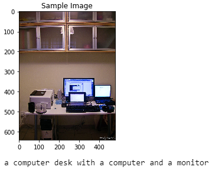
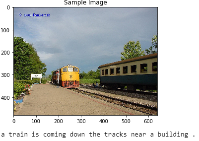
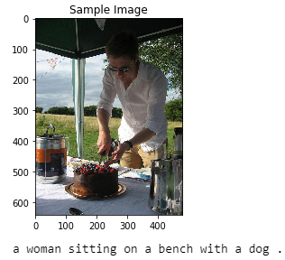
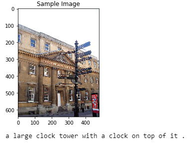

# Udacity Image Captioning

## Project Overview

This project is the second project from from Udacity's [Computer Vision Nanodegree](https://www.udacity.com/course/computer-vision-nanodegree--nd891). "In this project, you will create a neural network architecture to automatically generate captions from images. After using the Microsoft Common Objects in COntext (MS COCO) dataset to train your network, you will test your network on novel images!"

The project will be broken up into a few main parts in four Python notebooks:

`Notebook 0: Dataset` Initialize the COCO API to obtain the data

`Notebook 1: Preliminaries` Explore and use the Dataloader to obtain batches, Experiment with the CNN Encoder, and Implement the RNN Decoder

`Notebook 2: Training` Train the model

`Notebook 3: Inference` Load Trained Models and generate predictions

## Examples of predictions

These are found in the [Notebook 3: Inference](UdacityImageCaptioning/3_Inference.ipynb)

### Good predictions

### Bad predictions

LICENSE: This project is licensed under the terms of the MIT license.
